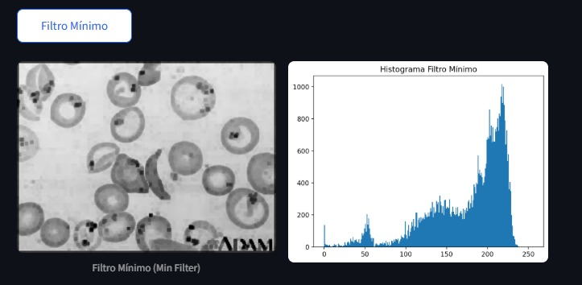
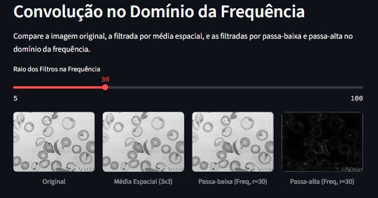

# Processamento de Imagens com OpenCV e Streamlit

Este projeto é um aplicativo web para processamento de imagens em Python, utilizando as bibliotecas OpenCV, NumPy, Matplotlib e Streamlit. Permite aplicar filtros, transformações de intensidade, segmentação e operações morfológicas em imagens.

## Funcionalidades
- Upload de imagens (PNG, JPG, JPEG, BMP, TIF)
- Filtros passa-baixa: média, mediana, gaussiano, máximo, mínimo
- Filtros passa-alta: Laplaciano, Roberts, Prewitt, Sobel
- Transformações de intensidade: alargamento de contraste, equalização de histograma
- Segmentação: Otsu
- Morfologia matemática: erosão e dilatação
- Download das imagens processadas

## Exemplos de Resultados

### 1. Visualização Inicial


**Descrição:**  
Esta imagem mostra a interface do projeto logo após o upload de uma imagem. À esquerda, está a imagem original carregada pelo usuário. À direita, é possível visualizar o histograma da imagem, que representa a distribuição dos níveis de intensidade dos pixels. Essa etapa permite analisar rapidamente as características básicas da imagem antes de aplicar qualquer processamento.

---

### 2. Filtro Passa-Baixa Mínimo



**Descrição:**  
Aqui é exibido o resultado da aplicação do filtro passa-baixa mínimo (Min Filter). Esse filtro substitui cada pixel pelo menor valor encontrado em sua vizinhança definida pelo tamanho do kernel. O efeito visual é o escurecimento das áreas claras e a remoção de pequenos detalhes brilhantes, sendo útil para destacar regiões escuras e reduzir ruídos pontuais.

---

### 3. Convolução No Domínio da Frequência



**Descrição:**  
Esta imagem apresenta o resultado da aplicação de uma convolução sobre a imagem original utilizando um kernel específico (por exemplo, média, gaussiano ou outro). A convolução é uma operação fundamental no processamento de imagens, pois permite suavizar, realçar bordas ou aplicar outros efeitos conforme o kernel escolhido. Na imagem, é possível observar como a filtragem altera a aparência da imagem original, destacando ou suavizando detalhes.

## Instalação

1. **Clone este repositório:**
```bash
git clone https://github.com/estefanialopes/Projeto_PDI.git
cd Projeto_PDI
```

2. **Crie um ambiente virtual (opcional, mas recomendado):**
```bash
python -m venv venv
# No Windows:
venv\Scripts\activate
# No Linux/Mac:
source venv/bin/activate
```

3. **Instale as dependências:**
```bash
pip install -r requirements.txt
```

## Execução

Execute o aplicativo Streamlit:
```bash
python -m streamlit run app.py
```

Acesse o endereço mostrado no terminal (geralmente http://localhost:8501).

## Estrutura dos arquivos
- `app.py`: Interface principal do Streamlit
- `filtros.py`: Funções de processamento de imagem
- `requirements.txt`: Lista de dependências

## Requisitos
- Python 3.8+


